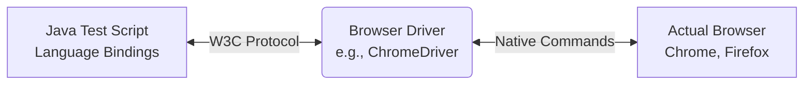

# Selenium Testing in a Spring Boot Web Application
**Software Testing Course Presentation**

---

## 1. What is Selenium?
* An open-source, automated testing framework for web applications.
* Simulates real user interactions (clicking, typing, navigating) in a browser.
* Supports multiple programming languages (Java, Python, C#, etc.).
* Works seamlessly with Spring Boot when integrated with testing frameworks like JUnit or TestNG.

---

## 2. How Selenium Works
* **Language Bindings:** You write tests in Java.
* **Driver Communication:** The code communicates with a Browser Driver via the W3C WebDriver Protocol.
* **Browser Execution:** The Browser Driver translates these commands into native actions on the actual browser (Chrome, Firefox, Edge, etc.).
* **Response:** The browser sends the response back to the code, allowing validation of test assertions.

---

## 3. Selenium Architecture Diagram



---

## 4. Key Concepts in Selenium

* **`WebDriver`**: The main interface to control the browser (e.g., `ChromeDriver`, `FirefoxDriver`).
* **`WebElement`**: Represents an HTML element on the web page (e.g., a button or text box).
* **`By`**: A mechanism to locate elements on the page (e.g., `By.id("login")`, `By.cssSelector(".btn")`).
* **`Wait`**: Handles timing issues related to network loading and JS rendering. 
  * *Implicit Wait:* Waits a default maximum time globally for elements to appear.
  * *Explicit Wait (`WebDriverWait`):* Waits for a specific condition (e.g., waiting specifically for a button to become clickable).

---

## 5. Example Selenium Test Code (Java)

```java
import org.junit.jupiter.api.*;
import org.openqa.selenium.*;
import org.openqa.selenium.chrome.ChromeDriver;
import org.springframework.boot.test.context.SpringBootTest;

// Start the Spring Boot app on a defined port before testing
@SpringBootTest(webEnvironment = SpringBootTest.WebEnvironment.DEFINED_PORT)
public class LoginUITest {
    private WebDriver driver;

    @BeforeEach
    public void setUp() {
        driver = new ChromeDriver(); // Start browser
    }

    @Test
    public void testValidLogin() {
        // 1. Navigate
        driver.get("http://localhost:8080/login");
        
        // 2. Locate & Act
        driver.findElement(By.id("username")).sendKeys("student");
        driver.findElement(By.id("password")).sendKeys("pass123");
        driver.findElement(By.id("login-btn")).click();
        
        // 3. Assert
        String title = driver.getTitle();
        Assertions.assertEquals("Dashboard", title);
    }

    @AfterEach
    public void tearDown() {
        driver.quit(); // Close browser
    }
}
```

---

## 6. Automated UI Testing Workflow

1. **Setup:** Initialize the `WebDriver` and launch the selected browser.
2. **Navigate:** Open the target URL of the application.
3. **Locate:** Find target UI components dynamically using locators (`By`).
4. **Interact:** Perform user actions (click, type text, clear inputs).
5. **Assert:** Verify the expected outcome matches the actual UI state.
6. **Teardown:** Close the browser and abruptly clean up the automation session.

---

## 7. Common Selenium Testing Errors

* **`NoSuchElementException`**: The element doesn't exist in the DOM, is not loaded yet, or the locator is incorrect.
* **`TimeoutException`**: An explicitly awaited element condition was not met within the allotted time limit.
* **`StaleElementReferenceException`**: The element you are trying to interact with has been re-rendered or destroyed in the DOM (e.g., due to an AJAX update or page refresh).
* **`ElementNotInteractableException`**: A button or form exists but is hidden, disabled, or overlapped by a pop-up modal.

---

## 8. Advantages of Selenium Automation Testing

* **Cost-Effective:** Completely free and open-source.
* **Language & OS Agnostic:** Write in Java, run on Windows, macOS, or Linux.
* **Cross-Browser Support:** Test application layouts identically across Chrome, Edge, Firefox, and Safari.
* **CI/CD Integration:** Easily works alongside build tools (Maven) and pipelines (Jenkins, GitHub Actions) to run UI tests automatically after code changes.

---

## Thank You / Q&A
